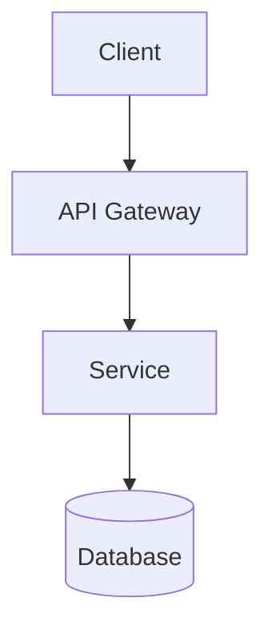

# Architektura systému {{PROJECT_NAME}}

Tento soubor popisuje **aktuální** architekturu systému. Změny architektonického přístupu zaznamenávejte jako ADR (`decisions/ADR-*.md`), ne jako changelog v tomto souboru.

## Přehled

<!-- High-level popis systému: co dělá, jaké má hlavní komponenty. -->

## Hlavní komponenty

<!-- Seznam hlavních komponent / subsystémů, s jednořádkovým popisem a odkazem na detail. -->

<!--
- **{{KOMPONENTA_1}}** — popis. Viz `modules/{{slug}}/architecture/`.
- **{{KOMPONENTA_2}}** — popis. Viz `modules/{{slug2}}/architecture/`.
-->

## Technologický stack

<!-- Jazyky, frameworky, runtime. -->

## Klíčová architektonická rozhodnutí

Všechna rozhodnutí jsou v `decisions/`:

<!-- Seznam ADR, pokud máme. Alternativně odkaz na index. -->

## Deployment

<!-- Jak se nasazuje, kam, jak často. -->

## Integrace s externími systémy

<!-- Seznam externích závislostí (databáze, API, message brokery). -->

## Diagramy

Diagramy jsou v `diagrams/`. Preferovaný formát: [Mermaid](https://mermaid.js.org/) (inline v markdownu, verzovatelné).

